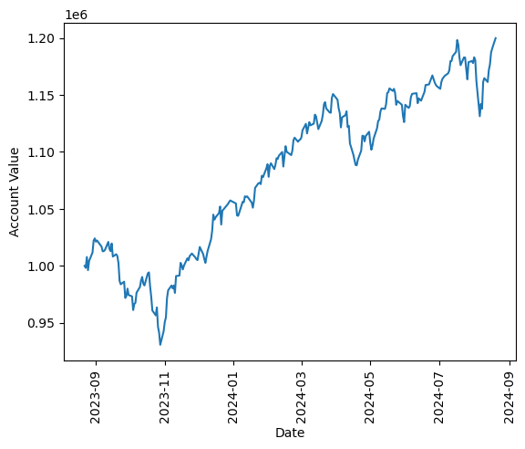

# stock-market-simulator

This is my first project to learn to use GitHub. 
I am using one of my favourite topic, finance & stock markets.

### The simulator strategy:

**To buy the stocks:**

The simulator calculates the short-term moving average (50 days) and the long-term moving average (150 days).
The average logarithmic price change over the past week is also calculated.

If the short-term moving average is greater than the long-term moving average then the stock is bought. Also, if the average price change is more than 1% in the past week then the stock is bought.

**To sell the stocks:**

The stocks are sold if the short-term moving average is less than the long-term moving average. 
Also, if the stock price falls by 2% or gains 4%, the stock is sold.

**The performance over the past year (the account value is in tens of millions):**
